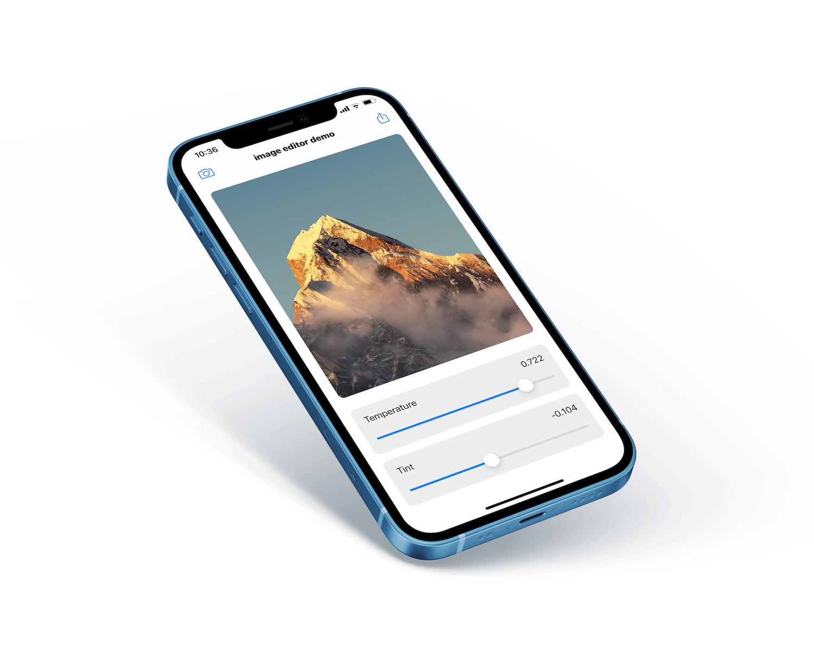

# Introduction To Metal Compute

For a couple of yers I've been working as iOS software engineer with a focus on GPGPU on Metal.  It is an interesting sphere of iOS development which still lacks of spread. In a [series of articles](https://eugenebokhan.github.io/blog/introduction-to-metal-compute-part-one) I'm going to describe how to build a simple image processing metal app. This repository contains source code for this demo application.

    

License: [MIT](LICENSE).
